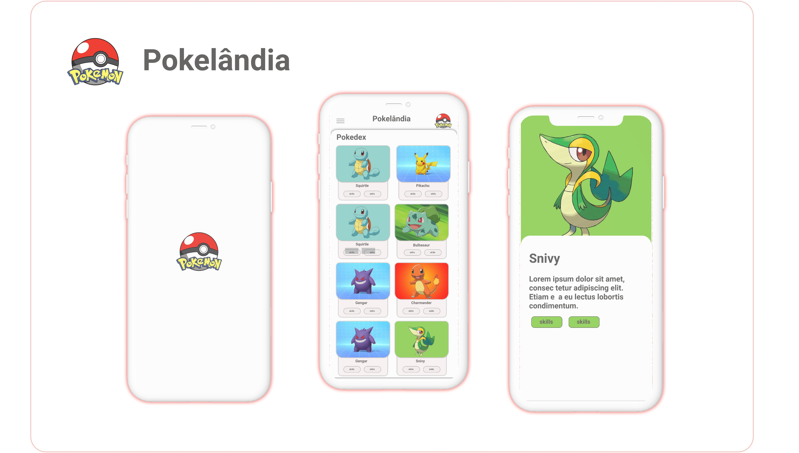

<h2 align="center">
    
</h2>

✅ A test to manage Pokemon lists 

  <row>
    
    
    
    
  </row>

 

## 📱 Prototype

  

 

## 🚀 Technologies

This project was developed with the following technologies and libraries:
- [Flutter](https://flutter.dev/)
- [Bloc](https://pub.dev/packages/bloc)
- [Http Connection](https://pub.dev/packages/http)
- [Shared Preferences](https://pub.dev/packages/shared_preferences)

## 💻 About
This project aims to meet some requirements to test the knowledge level of the mobile development stack mentioned above. The app displays/manages a list of files provided by the api [Poko Api] (https://pokeapi.co/docs/v2).

## 🤔 How to contribute?

- Fork the repository;
- Create a branch named after your improvement/fix: `git checkout -b feature/your_feature_name`;
- Commit your changes: `git commit -m 'feat: My new feature'`;
- Push your branch: `git push origin feature/your_feature_name`.
- open a PR here 💙.

## 📝 License

This project has the MIT license. See the [LICENSE](LICENSE) for more details.

---

Create with 💙 by Judson Henrique
